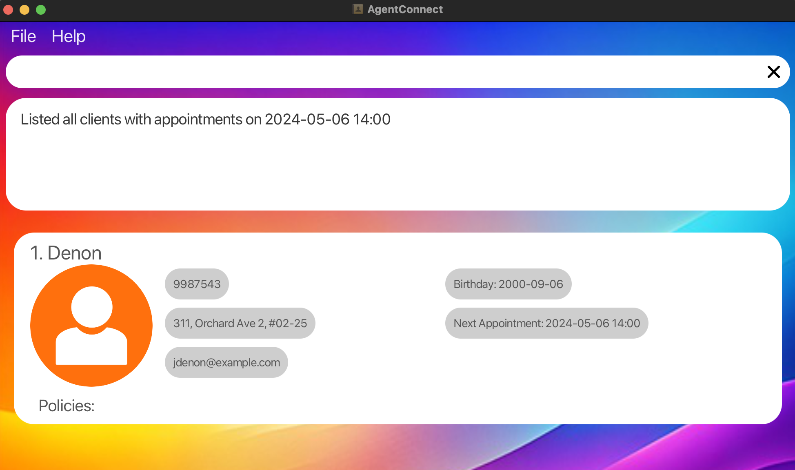
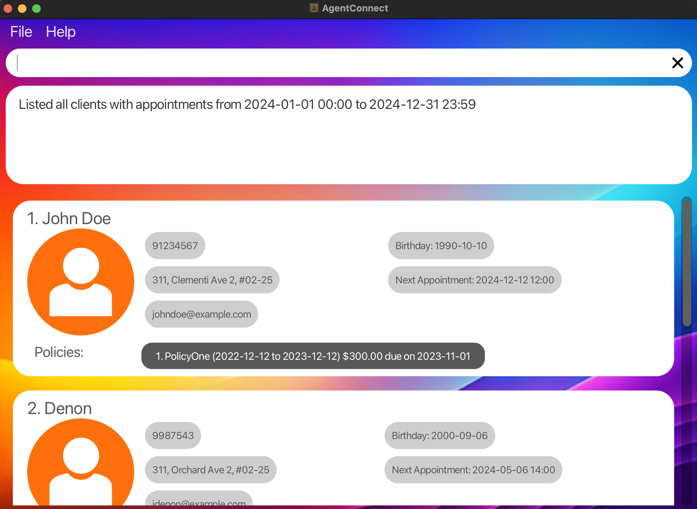
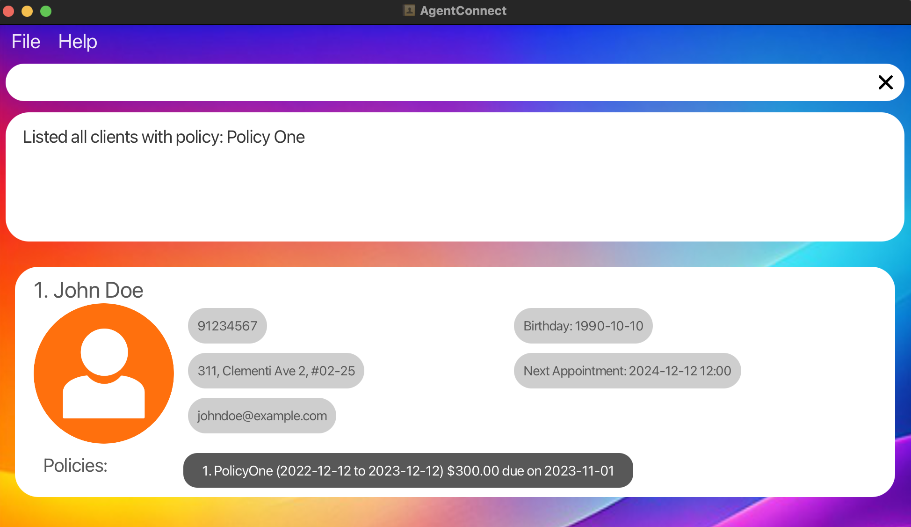
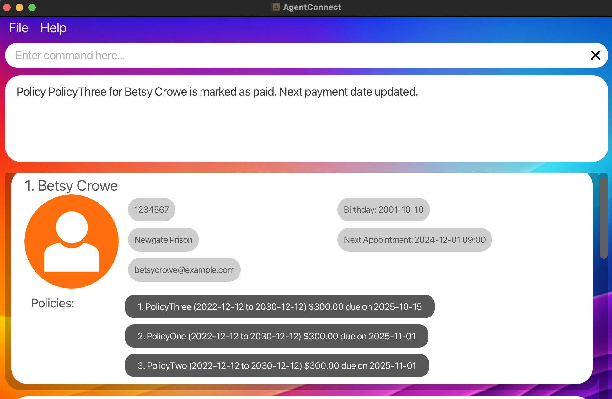
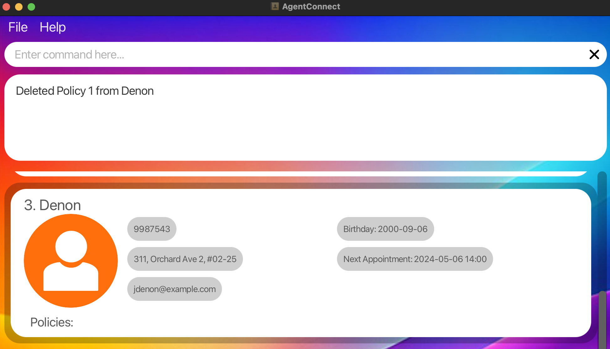

Welcome to the **AgentConnect User Guide**!

AgentConnect is a desktop application designed to help you manage your client's contacts efficiently. It's especially useful for insurance agents who needs to keep track of clients, appointments, and policies. 

AgentConnect combines the speed of typing commands with the ease of a visual interface, making it both powerful and user-friendly.

AgentConnect will help you manage your contacts faster than traditional apps.

---

## Table of Contents

## Table of Contents

1. [Quick Start](#quick-start)
2. [Getting Started](#getting-started)
    - [Viewing Help](#viewing-help)
    - [Saving Your Data](#saving-your-data)
    - [Exiting the Program](#exiting-the-program)
3. [Client Management](#client-management)
    - [Adding a Client](#adding-a-client)
    - [Editing Client Details](#editing-client-details)
    - [Deleting a Client](#deleting-a-client)
    - [Listing All Clients](#listing-all-clients)
    - [Sorting Clients](#sorting-clients)
4. [Policy Management](#policy-management)
    - [Assigning a Policy](#assigning-a-policy)
    - [Deleting a Policy](#deleting-a-policy)
5. [Search Functions](#search-functions)
    - [Locating Clients by Name](#locating-clients-by-name)
    - [Searching Appointments](#searching-appointments)
    - [Searching Birthdays](#searching-birthdays)
    - [Searching Policies](#searching-policies)
6. [Advanced Features](#advanced-features)
    - [Undo a Command](#undo-a-command)
    - [Redo a Command](#redo-a-command)
    - [Clearing All Entries](#clearing-all-entries)
7. [Frequently Asked Questions (FAQ)](#frequently-asked-questions-faq)
8. [Known Issues](#known-issues)
9. [Command Summary](#command-summary)

--------------------------------------------------------------------------------------------------------------------

## Quick start

1. **Ensure Java is Installed:**
   Make sure you have **Java 17 or above** installed on your computer. If you're not sure, you can download it from [here](https://www.oracle.com/java/technologies/downloads/).

2. **Download AgentConnect:**
   Get the latest version of AgentConnect from [this link](https://github.com/se-edu/addressbook-level3/releases). Look for a file named `AgentConnect.jar`.

3. **Place the File:**
   Move the `AgentConnect.jar` file to a folder where you want to store the application and its data.

4. **Run the Application:**
    - **Option 1: Double-Click:**
      Simply double-click the `AgentConnect.jar` file to start the application.
    - **Option 2: Use Command Prompt:**
      Open the Command Prompt (Windows) or Terminal (Mac/Linux), navigate to the folder containing the `AgentConnect.jar` file, and type:
      ```
      java -jar AgentConnect.jar
      ```
      Then press **Enter**. To learn more about directory navigation, refer to this [link](https://gomakethings.com/navigating-the-file-system-with-terminal/).

5. **Try It Out:**
    - **Enter a Command:**
      Type a command into the command box at the bottom and press **Enter**. For example, type `help` to see the help message.
    - **Explore:**
      Feel free to experiment with different commands.

6. Refer to the [Features](#features) below for details of each command.

--------------------------------------------------------------------------------------------------------------------
## Features

AgentConnect offers a range of features to help you manage your clients effectively.

### Understanding Command Format

- **Angle brackets <>** are placeholders for information you need to provide.
  Example: In `add n/<NAME>`, replace `NAME` with the client's name.

- **Square brackets [ ]** indicate optional items.
  Example: `n/<NAME> [t/TAG]` means the `t/TAG` part is optional.

- **Ellipsis ...** means you can include the item multiple times or not at all.
  Example: `[t/TAG]...` allows for multiple tags or none.

- **Order Doesn't Matter**
  You can enter the parameters in any order.
  Example: `n/John p/123` is the same as `p/123 n/John`.

- **Extra Parameters are Ignored**
  For commands that don't require additional input, any extra text will be ignored.

* If you are using a PDF version of this document, be careful when copying and pasting commands that span multiple lines as space characters surrounding line-breaks may be omitted when copied over to the application.

---

### Viewing Help : `help`

Shows a message explaning how to access the help page.


Format: `help`

---

### Adding a client : `add`

Adds a client to the address book.

Format: `add n/<NAME> p/<PHONE NUMBER> e/<EMAIL ADDRESS> addr/<ADDRESS> b/<BIRTHDAY >appt/<APPOINTMENT TIME>`

- **Parameters**:
  - Birthday should be in `yyyy-mm-dd`
  - Appointment should be in `yyyy-mm-dd HH:mm`

Examples:
* `add n/John Doe p/98765432 e/johnd@example.com addr/John street, block 123, #01-01 b/2000-12-12 appt/2024-12-12 12:00`
* `add n/Betsy Crowe e/betsycrowe@example.com addr/Newgate Prison p/1234567 b/2001-10-10 appt/2024-12-01 09:00`

---

### Assigning a policy : `assign`

Assigns policies to a client.

Format: `assign <INDEX> pon/<POLICY NAME> /pos<POLICY START DATE> /poe <POLICY END DATE> /paydate <INSURANCE DUE DATE> /amt <AMOUNT DUE>`
- **Parameters**:
  - Policy start date and end date refers to the duration of coverage
  - Policy start date and Policy end date should be in `yyyy-mm-dd`
  - Pay date should be in `yyyy-mm-dd` format
  - Amount Due can only be Big Decimal format


Examples:
* `assign 1 pon/PolicyOne pos/2022-12-12 poe/2023-12-12 paydate/2023-11-01 amt/300.00`
* This command assigns the Policy object to the client listed at index 1 with the following information:
  * Policy Name: PolicyOne
  * Policy start date: 2022-12-12
  * Policy end date: 2023-12-12
  * Premium due date: 2023-11-01
  * Amount Due: $300.00

  

---

### Listing all clients : `list`

Shows a list of all clients in the address book.

Format: `list`

---

### Editing a client details : `edit`

Edits an existing client in the address book.

Format: `edit INDEX [n/NAME] [p/PHONE] [e/EMAIL] [a/ADDRESS] [t/TAG] [b/BIRTHDAY] [appt/APPOINTMENT] [po/POLICY_INDEX pon/POLICY_NAME pos/START_DATE poe/END_DATE paydate/PAY_DATE amt/AMOUNT]…​`

- **Parameters**:

  * Edits the client at the specified `INDEX`. The index refers to the index number shown in the displayed client list. The index **must be a positive integer** 1, 2, 3, …​
  * At least one of the optional fields must be provided.
  * Existing values will be updated to the input values.
  * When editing tags, the existing tags of the client will be removed i.e adding of tags is not cumulative.
  * You can remove all the client’s tags by typing `t/` without
      specifying any tags after it.
  * When editing birthday and policy, the date format should be `yyyy-mm-dd`
  * When editing appointment, the date and time format should be `yyyy-mm-dd hh:mm` in 24-hour notation
  * When editing policy, all fields of policy must be included

Examples:
- **Edits the phone number and email address of the 1st client to be `91234567` and `johndoe@example.com` respectively.**:
  ```
  edit 1 p/91234567 e/johndoe@example.com
  ```
  

- **Edits the name of the 2nd client to be `Betsy Crower` and clears all existing tags.**:
  ```
  edit 2 n/Betsy Crower t/
  ```

- **Edits the 1st policy of the 3rd client to be `Health Insurance` which valid from `2024-10-19` to `2025-10-19` which pay date on `2024-11-19`
  and amount of `200`**:
  ```
  edit 3 po/1 pon/Health Insurance pos/2024-10-19 poe/2025-10-19 paydate/2024-11-19 amt/200
  ```
---

### Locating clients by name : `find`

Finds clients whose names contain any of the given keywords.

Format: `find <KEYWORD> [MORE_KEYWORDS]`

- **Parameters**:
  * The search is case-insensitive. e.g `hans` will match `Hans`
  * The order of the keywords does not matter. e.g. `Hans Bo` will match `Bo Hans`
  * Only the name is searched.
  * Only full words will be matched e.g. `Han` will not match `Hans`
  * Clients matching at least one keyword will be returned (i.e. `OR` search).
    e.g. `Hans Bo` will return `Hans Gruber`, `Bo Yang`

Examples:
* `find John` returns `john` and `John Doe`
* `find alex david` returns `Alex Yeoh`, `David Li`<br>
  

---

### Searching appointments : `search a/`

Finds clients with appointments on a specific date or within a date range.

Format: `search a/ <DATETIME>` | `search a/ <DATETIME> to  <DATETIME>`
- **Parameters**:
  - `DATETIME`: A specific date and time in `YYYY-MM-DD HH:mm` format.

- **Usage**:
  - **Single Datetime Search**: Lists all clients with appointments on the specified date and time.
  - **Range Datetime Search**: List all clients with appointments that is within the given date and time range.

Examples:
  - **Search by Specific Datetime**:
    ```
    search a/ 2024-12-12 23:00
    ```
    *Finds all clients with appointments on December 12, 2024, 11PM.*

    
  - **Search by Range Datetime**:
    ```
    search a/ 2024-12-12 23:00 to 2024-12-31 23:00
    ```
    *Finds all clients with appointments from December 12, 2024, 11PM to December 31, 2024, 11PM.*

    

---

### Searching birthdays : `search b/`

Finds clients who have birthdays on a specific date or within a date range.

Format: `search b/ <DATE>` | `search a/ <DATE> to <DATE>`

- **Parameters**:
  - `DATE`: A specific date in `YYYY-MM-DD` format.

- **Usage**:
  - **Single Date Search**: Lists all clients whose birthdays fall on the specified date.
  - **Range Date Search**: Lists all clients whose birthdays that is within the given date range.

Examples:
  - **Search by Specific Date**:
    ```
    search b/ 1990-01-01
    ```
    *Finds all clients with a birthday on January 1, 1990.*

    
  - **Search by Range Date**:
    ```
    search b/ 1990-01-01 to 1992-01-01
    ```
    *Finds all clients with a birthdays between January 1, 1990, to January 1, 1992.*
    


---

### Searching policy : `search p/`

Finds clients who have currently owns a certain policy.

Format: `search p/ <POLICY_NAME>`

- **Parameters**:
  - `POLICY_NAME`: A specific policy name.

- **Usage**:
  - **Single Policy Search**: Lists all clients who own the policy .

Examples:
  - **Search by Specific Policy**:
    ```
    search p/ Policy One
    search p/ PolicyOne
    ```
    *Finds all clients who own the policy named "PolicyOne".*

    

---

### Sorting clients : `sort`

Organizes your client list based on different criteria for easier management and viewing.

Format: `sort <CRITERIA> <ORDER>`

- **Parameters**:
  - `CRITERIA`: The attribute by which you want to sort the clients. Available criteria include:
      - `n/`: Sort by client's name (A-Z by default).
      - `b/`: Sort by client's birthday (earliest to latest by default).
      - `appt`: Sort by upcoming appointment dates (soonest to latest by default).
      - `paydate`: Sort by policy payment due date (earliest to latest by default).
  - `ORDER`: The direction of sort. Available order includes:
    - `asc`: Sort in ascending order
    - `dsc`: Sort in descending order

- **Usage**:
  - **Name Sorting**: Orders the client list alphabetically by name.
  - **Birthday Sorting**: Orders the client list by birthday dates.
  - **Appointment Sorting**: Orders the client list by the dates of upcoming appointments.
  - **Policy Sorting**: Orders the client list based on policy details.

Examples:
  - **Sort by Name in Ascending Order**:
    ```
    sort n/ asc
    ```
    *Sorts the client list alphabetically by each client's name.*

    

  - **Sort by Birthday in Descending Order**:
    ```
    sort b/ dsc
    ```
    *Sorts the client list from the latest to the earliest birthday.*

    

  - **Sort by Appointment Date in Ascending Order**:
    ```
    sort appt/ asc
    ```
    *Sorts the client list based on the earliest to the latest upcoming appointments.*

    

  - **Sort by Policy Payment Due Date in Ascending Order**:
  ```
  sort paydate/ asc
  ```
  *Sorts the client list based on the earliest to the latest payment due date of the policy.*

  

---

### Marking a policy payment installment as paid : `paid`

Marks a policy payment installment as paid for a client.

Format: `paid <INDEX> pon/<POLICY_NAME>`
- **Parameters**:
  - `INDEX`: The index of the client in the client list.
  - `POLICY_NAME`: The name of the policy to be marked as paid.
  - The index refers to the index number shown in the displayed client list. The index **must be a positive integer** 1, 2, 3, …​
  - The policy name is case-sensitive and must be an exact match.
  
- **Usage**:
  - **Updating Payment Due Date**: The payment due date of the policy will be updated to the next scheduled date (ie. one year later).
  - **Setting Amount Due to 0**: The amount due will be set to 0 once the final installment of the insurance payment is completed.

Examples:
  - **Marking a Policy Payment Installment as Paid**:
  ```
  paid 1 pon/PolicyOne
  ```
  *Marks the policy named "PolicyOne" as paid for the client at index 1.*
    
  

---

### Deleting a client or policy : `delete`

#### Client:
Deletes the specified client from the application. There is a confirmation message before the deletion is executed. Type `y` to confirm deletion.

Format: `delete <INDEX>` or `delete <NAME>`
- **Parameters**:
  * Deletes the client at the specified `INDEX` or the specific `NAME`.
  * The index and name refers to the index number or name shown in the displayed client list.
  * The index **must be a positive integer** 1, 2, 3, …​
  * The name of the client is case-sensitive and must be an exact match.

Examples:
* `list` followed by `delete 2` deletes the 2nd client in the address book.
* `find Betsy` followed by `delete 1` deletes the 1st client in the results of the `find` command.
* `delete Betsy Crowe` deletes the client named `Betsy Crowe` from the list of the address book.
  

#### Policy:
Deletes the specified policy from the specified client using INDEX of the client and policy.

Format: `delete <INDEX> po/<POLICY_INDEX>`

* Deletes the policy at the specified `POLICY_INDEX` of the client at the specified `INDEX`.

Examples:

* `delete 1 po/1` deletes the 1st policy of the 1st person in the address book.
* `delete 2 po/1` deletes the 1st policy of the 2nd person in the address book.
  
---
### Undo a command : `undo`
Undo the last delete. Works for add, edit, delete client and clear commands.

Format: `undo` 

* Undo the last command to restore the address book to the state before the last command.
* Does not work for assign and deletion of policies.

Examples:
* `delete 1` followed by `undo` will restore back the deleted client at index 1.
* `clear` followed by `undo` will restore back all the deleted clients.


---
### Redo a command : `redo`
Redo the last undo. Works for add, edit, delete client and clear commands.

Format: `redo`

* Redo the last undo command to restore the address book to the state before the undo command.
* Does not work for assign and deletion of policies.

Examples:
* `delete 1` followed by `undo` followed by `redo` will delete the client at index 1 again.
* `clear` followed by `undo` followed by `redo` will clear all the entries again.


---

### Clearing all entries : `clear`

Clears all entries from the address book.

Format: `clear`

---

### Exiting the program : `exit`

Exits the program.

Format: `exit`

---

### Saving the data

AgentConnect data are saved in the hard disk automatically after any command that changes the data. There is no need to save manually.

---

### Editing the data file

AddressBook data are saved automatically as a JSON file `[JAR file location]/data/addressbook.json`. Advanced users are welcome to update data directly by editing that data file.

<div markdown="span" class="alert alert-warning">:exclamation: **Caution:**
If your changes to the data file makes its format invalid, AddressBook will discard all data and start with an empty data file at the next run. Hence, it is recommended to take a backup of the file before editing it.<br>
Furthermore, certain edits can cause the AddressBook to behave in unexpected ways (e.g., if a value entered is outside of the acceptable range). Therefore, edit the data file only if you are confident that you can update it correctly.
</div>

---

### Archiving data files `[coming in v2.0]`

_Details coming soon ..._

--------------------------------------------------------------------------------------------------------------------

## Frequently Asked Questions (FAQ)

**Q:** How do I check if I have Java installed?

**A:** Open the Command Prompt or Terminal and type `java -version`. If Java is installed, it will show the version number.

---

**Q:** Can I run AgentConnect on a Mac or Linux computer?

**A:** Yes! As long as you have Java 17 or above installed, AgentConnect will work on Windows, Mac, and Linux.

---

**Q:** How do I back up my data?

**A:** Your data is stored in the `addressbook.json` file in the `data` folder. Copy this file to a safe location to back up your data.

---

**Q:** What happens if I enter the wrong command?

**A:** AgentConnect will show an error message explaining what went wrong. You can then try the command again.

---

**Q:** Can I assign multiple policies to one client?

**A:** Yes, you can assign multiple policies by using the `assign` command multiple times for the same client.


--------------------------------------------------------------------------------------------------------------------

## Known Issues

1. **Multiple Screens**: If you use multiple monitors and move AgentConnect to a secondary screen, it may open off-screen if that monitor is disconnected.
   **Solution**: Delete the `preferences.json` file in the application folder before restarting AgentConnect.

2. **Help Window Minimization**: If you minimize the Help window and try to open it again, it may stay minimized.  
   **Solution**: Restore the Help window manually.

--------------------------------------------------------------------------------------------------------------------

## Command Summary

| Action                         | Command Format                                                                                                                                                                                                                 |
|--------------------------------|--------------------------------------------------------------------------------------------------------------------------------------------------------------------------------------------------------------------------------|
| **Add a Client**               | `add n/<NAME> p/<PHONE_NUMBER> e/<EMAIL> addr/<ADDRESS> b/<BIRTHDAY> appt/<APPOINTMENT>`<br>Example: `add n/John Doe p/91234567 e/john@example.com addr/123 Street b/1990-01-01 appt/2024-12-12 14:00`                         |
| **Assign a Policy**            | `assign INDEX pon/<POLICY_NAME> pos/<START_DATE> poe/<END_DATE> paydate/<PAYMENT_DUE_DATE> amt/<AMOUNT_DUE>`<br>Example: `assign 1 pon/Health Insurance pos/2022-01-01 poe/2023-01-01 paydate/2022-12-01 amt/300.00`           |
| **List Clients**               | `list`                                                                                                                                                                                                                         |
| **Edit a Client**              | `edit INDEX [n/NAME] [p/PHONE] [e/EMAIL] [addr/ADDRESS] [b/BIRTHDAY] [appt/APPOINTMENT] [po/POLICY_INDEX pon/POLICY_NAME pos/START_DATE poe/END_DATE paydate/PAYMENT_DUE_DATE amt/AMOUNT_DUE]`<br>Example: `edit 2 p/98765432` |
| **Find Clients**               | `find <KEYWORD> [MORE_KEYWORDS]`<br>Example: `find Alice`                                                                                                                                                                      |
| **Search Appointment**         | `search a/ <DATETIME>`<br>Example: `search a/ 2024-10-10 23:00`                                                                                                                                                                |
| **Search Birthday**            | `search b/ <DATE>`<br>Example: `search b/ 2000-03-15`                                                                                                                                                                          |
| **Search Policy**              | `search p/ <POLICY_NAME>`<br>Example: `search p/ sample Policy`                                                                                                                                                                |
| **Sort Client Data**           | `sort <CRITERIA> <ORDER>`<br>Example: `sort birthday asc`                                                                                                                                                                      |
| **Delete a Client**            | `delete <INDEX>` or `delete <NAME>`<br>Example: `delete 3` or `delete John Doe`                                                                                                                                                |
| **Undo the last deleted work** | `undo`                                                                                                                                                                                                                         |
| **Redo the last undo work**    | `redo`                                                                                                                                                                                                                         |
| **Clear All Entries**          | `clear`                                                                                                                                                                                                                        |
| **Exit Application**           | `exit`                                                                                                                                                                                                                         |
| **View Help**                  | `help`                                                                                                                                                                                                                         |
